  

 

  

 

 

  

 

**GitWicket** turns public GitHub activity into a cricket player card: commits become strike rate, pull requests become wickets, stars become boundaries. LeetCode profiles get the same treatment, and the **Career Card** combines GitHub, CV, LeetCode and career goals into an evidence-based profile of what your work supports, what is missing and what to do next. **Compare** puts two GitHubs head to head.

Next.js · TypeScript · Tailwind CSS · GitHub GraphQL · Redis · @vercel/og · Vercel 
<a href="https://github.com/Ashmit-702/Gitwicket">GitHub</a> &nbsp;·&nbsp; <a href="https://gitwicket-ten.vercel.app">Live</a>

 

## Flagship Projects

<table>
<tr>
<td width="50%" valign="top" align="center">

 <a href="https://github.com/Ashmit-702/final-health">GitHub</a> &nbsp;·&nbsp; <a href="https://dadi-healthchat.onrender.com/">Live</a>
</td>
<td width="50%" valign="top" align="center">

 <a href="https://github.com/Ashmit-702/Mainland">GitHub</a> &nbsp;·&nbsp; <a href="https://mainland-iota.vercel.app">Play</a>
</td>
</tr>
<tr>
<td width="50%" valign="top" align="center">

 <a href="https://github.com/Ashmit-702/Netaboard">GitHub</a> &nbsp;·&nbsp; <a href="https://neta-ashen.vercel.app">Live</a>
</td>
<td width="50%" valign="top" align="center">

 <a href="https://github.com/Ashmit-702/Stockfi">GitHub</a> &nbsp;·&nbsp; <a href="https://stockfi-uq2v.onrender.com/dashboard/">Live</a>
</td>
</tr>
</table>

## More Projects

<table>
<tr>
<td width="33%" valign="top" align="center">

 <a href="https://github.com/Ashmit-702/Ashlysis-done">GitHub</a> &nbsp;·&nbsp; <a href="https://ashlysis.onrender.com">Live</a>
</td>
<td width="33%" valign="top" align="center">

 <a href="https://github.com/Ashmit-702/CV-Analyze">GitHub</a> &nbsp;·&nbsp; <a href="https://cv-analyze-liard.vercel.app">Live</a>
</td>
<td width="33%" valign="top" align="center">

 <a href="https://github.com/Ashmit-702/One">GitHub</a>
</td>
</tr>
<tr>
<td width="33%" valign="top" align="center">

 <a href="https://github.com/Ashmit-702/Passwrod-O">GitHub</a>
</td>
<td width="33%" valign="top" align="center">

 <a href="https://github.com/Ashmit-702/OIBSIP-f">GitHub</a>
</td>
<td width="33%" valign="top" align="center">

 <a href="https://github.com/Ashmit-702/Station-Weather">GitHub</a>
</td>
</tr>
</table>

 

### Other Builds

| Project | Description | Stack | Repository |
|:--|:--|:--|:--|
| **LinkedIn CRM** | LinkedIn API research and CRM work from my internship | LinkedIn API | [GitHub](https://github.com/Ashmit-702/Linnkedin-CRM) |
| **Autonomous AI Creator** | Self-running publishing persona: topics in from Hacker News, arXiv and GitHub, one LLM-picked story out | TypeScript · Next.js · Redis | [GitHub](https://github.com/Ashmit-702/Autonomous-ai-creator) |
| **URL Shortener** | Short links with click analytics; IPs stored only as SHA-256 hashes | Node.js · Express · PostgreSQL | [GitHub](https://github.com/Ashmit-702/Urlshortener) |

## How I Ship

  

 

| Pattern | Where it shows up |
|:--|:--|
| **Graceful AI fallback** | Mainland (scripted lines), Vitals+ (rule-based insights), ASHLYSIS (fallback study guidance) |
| **API key rotation** | Dadi and ASHLYSIS rotate Groq keys when one is rate-limited |
| **Caching** | GitWicket (six-hour Redis cache), One (SQLite cache with TTL) |
| **Scheduled jobs** | NetaBoard (Vercel Cron for the daily brief and refreshes) |
| **Testing** | NetaBoard (`node:test`), Stockfi (pytest), Station (pytest) |
| **Deployment** | Vercel and Render, with Docker Compose for CV Analyze |
| **Verification** | NetaBoard's `verify:prod` checks that a deployment is one coherent build |

## Tech Stack

  

 

**Recognition:** Konam AI Fellowship (selected) · AWS Academy Graduate, Cloud Foundations · Google Developers × AICTE AI-ML Virtual Internship · Altair × AICTE Data Science Master Internship · Honeywell AI Certificate

 

  
    <a href="mailto:ashmitsingh702@gmail.com">Email</a> &nbsp;·&nbsp;
    <a href="https://www.linkedin.com/in/ashmitvsingh/">LinkedIn</a> &nbsp;·&nbsp;
    <a href="https://ashmit-702.github.io/portfolio/">Portfolio</a>
  

