  

  
    <a href="mailto:ashmitsingh702@gmail.com"><strong>Email</strong></a>
    &nbsp;·&nbsp;
    <a href="https://www.linkedin.com/in/ashmitvsingh/"><strong>LinkedIn</strong></a>
    &nbsp;·&nbsp;
    <a href="https://ashmit-702.github.io/portfolio/"><strong>Portfolio</strong></a>
    &nbsp;·&nbsp;
    <a href="https://github.com/Ashmit-702"><strong>GitHub</strong></a>
  

 

  

 

  

## Special Mention · GitWicket

  

GitWicket turns public GitHub activity into a cricket player card: commits become strike rate, pull requests become wickets, and stars become boundaries. LeetCode profiles get the same treatment, while the **Career Card** combines GitHub, CV, LeetCode and career goals into an evidence-based profile. **Compare** puts two GitHub profiles head to head.

Next.js · TypeScript · Tailwind CSS · GitHub GraphQL · Redis · Vercel

 

  
    <a href="https://github.com/Ashmit-702/Gitwicket">GitHub ↗</a>
  

 

  

## Flagship Projects

<table>
  <tr>
    <td width="50%" valign="top" align="center">
      
      <a href="https://github.com/Ashmit-702/final-health">GitHub ↗</a> &nbsp;·&nbsp; <a href="https://dadi-healthchat.onrender.com/">Live ↗</a>
    </td>
    <td width="50%" valign="top" align="center">
      
      <a href="https://github.com/Ashmit-702/Mainland">GitHub ↗</a> &nbsp;·&nbsp; <a href="https://mainland-iota.vercel.app">Play ↗</a>
    </td>
  </tr>
  <tr>
    <td width="50%" valign="top" align="center">
      
      <a href="https://github.com/Ashmit-702/Netaboard">GitHub ↗</a> &nbsp;·&nbsp; <a href="https://neta-ashen.vercel.app">Live ↗</a>
    </td>
    <td width="50%" valign="top" align="center">
      
      <a href="https://github.com/Ashmit-702/Stockfi">GitHub ↗</a> &nbsp;·&nbsp; <a href="https://stockfi-uq2v.onrender.com/dashboard/">Live ↗</a>
    </td>
  </tr>
</table>

 

  

## More Projects

<table>
  <tr>
    <td width="33%" valign="top" align="center">
      
      <a href="https://github.com/Ashmit-702/Ashlysis-done">GitHub ↗</a> &nbsp;·&nbsp; <a href="https://ashlysis.onrender.com">Live ↗</a>
    </td>
    <td width="33%" valign="top" align="center">
      
      <a href="https://github.com/Ashmit-702/CV-Analyze">GitHub ↗</a> &nbsp;·&nbsp; <a href="https://cv-analyze-liard.vercel.app">Live ↗</a>
    </td>
    <td width="33%" valign="top" align="center">
      
      <a href="https://github.com/Ashmit-702/One">GitHub ↗</a>
    </td>
  </tr>
  <tr>
    <td width="33%" valign="top" align="center">
      
      <a href="https://github.com/Ashmit-702/Passwrod-O">GitHub ↗</a>
    </td>
    <td width="33%" valign="top" align="center">
      
      <a href="https://github.com/Ashmit-702/OIBSIP-f">GitHub ↗</a>
    </td>
    <td width="33%" valign="top" align="center">
      
      <a href="https://github.com/Ashmit-702/Station-Weather">GitHub ↗</a>
    </td>
  </tr>
</table>

 

### Other Builds

| Project | What it is | Stack | Repository |
| --- | --- | --- | --- |
| **LinkedIn CRM** | LinkedIn API research and CRM work from my internship | LinkedIn API | [GitHub ↗](https://github.com/Ashmit-702/Linnkedin-CRM) |
| **Autonomous AI Creator** | Self-running publishing pipeline from discovery to one LLM-selected story | TypeScript · Next.js · Redis | [GitHub ↗](https://github.com/Ashmit-702/Autonomous-ai-creator) |
| **URL Shortener** | Short links with click analytics and SHA-256 hashed IP storage | Node.js · Express · PostgreSQL | [GitHub ↗](https://github.com/Ashmit-702/Urlshortener) |

 

  

## How I Ship

  

 

| Pattern | Where it shows up |
| --- | --- |
| **AI resilience** | Graceful fallbacks in Mainland, Vitals+ and ASHLYSIS; key rotation in Dadi and ASHLYSIS |
| **Caching & scheduled work** | Redis/TTL caching in GitWicket and One; scheduled refreshes in NetaBoard |
| **Verification** | Automated tests across NetaBoard, Stockfi and Station; NetaBoard's production verification flow |
| **Production** | Vercel / Render deployments, with Docker Compose used for CV Analyze |

  

## Tech Stack

  

 

  
    <a href="mailto:ashmitsingh702@gmail.com">Email ↗</a>
    &nbsp;·&nbsp;
    <a href="https://www.linkedin.com/in/ashmitvsingh/">LinkedIn ↗</a>
    &nbsp;·&nbsp;
    <a href="https://ashmit-702.github.io/portfolio/">Portfolio ↗</a>
    &nbsp;·&nbsp;
    <a href="https://github.com/Ashmit-702">GitHub ↗</a>
  

