  

  
  
  
  

  

 

 

  

 

**GitWicket** turns public GitHub activity into a cricket player card.

- **GitHub → cricket stats:** commits become strike rate, pull requests become wickets, stars become boundaries
- **LeetCode → rated card:** Hard and Medium solved and acceptance rate feed their own stats, and the same signals flow into the Career Card
- **Career Card:** combines GitHub, CV, LeetCode and career goals into what is strongest, what needs evidence and what to do next
- **Compare:** two GitHubs, head to head

Next.js · TypeScript · Tailwind CSS · GitHub GraphQL · Redis · @vercel/og · Vercel 
<a href="https://github.com/Ashmit-702/Gitwicket"><b>GitHub ↗</b></a>

 

 

 

<table>
<tr>
<td width="50%" valign="top">

*A multilingual AI health companion with an Indian grandmother's voice.*

- Replies in Hindi, Hinglish or English, matching each message
- Triage returns an urgency score, possible causes and what to do next
- Reads lab reports from photos with Groq vision; rotates Groq keys on rate limits

Flask · Groq · PWA · Render 
<a href="https://github.com/Ashmit-702/final-health"><b>GitHub ↗</b></a> &nbsp;·&nbsp; <a href="https://dadi-healthchat.onrender.com/"><b>Live ↗</b></a>

</td>
<td width="50%" valign="top">

*A Mahabharata-inspired arcade dungeon crawler that ends at Kurukshetra.*

- Seven procedurally generated floors from Python serverless functions on Vercel
- Gemini-written NPC dialogue and boss taunts, each with a scripted fallback
- Vanilla JavaScript on a 2D canvas, no framework

Python · Vercel · Gemini · Vanilla JS · Canvas 
<a href="https://github.com/Ashmit-702/Mainland"><b>GitHub ↗</b></a> &nbsp;·&nbsp; <a href="https://mainland-iota.vercel.app"><b>Play ↗</b></a>

</td>
</tr>
<tr>
<td width="50%" valign="top">

*Politics, with receipts.*

- Claims → evidence → verdicts ledger, with elections and a daily brief
- Live news clustered and ranked; honest empty states instead of fabricated data
- Versioned Supabase migrations, Vercel Cron refreshes and unit tests

Next.js 14 · Supabase · PostgreSQL · Vercel Cron 
<a href="https://github.com/Ashmit-702/Netaboard"><b>GitHub ↗</b></a> &nbsp;·&nbsp; <a href="https://neta-ashen.vercel.app"><b>Live ↗</b></a>

</td>
<td width="50%" valign="top">

*Market chatter, turned into BUY / HOLD / SELL signals for Indian markets.*

- VADER sentiment with a finance lexicon over Indian financial news and tweets
- NumPy signal engine behind FastAPI endpoints for signals and history
- Plotly Dash dashboard with yfinance prices and PostgreSQL history

FastAPI · Pandas · NumPy · Dash · PostgreSQL 
<a href="https://github.com/Ashmit-702/Stockfi"><b>GitHub ↗</b></a> &nbsp;·&nbsp; <a href="https://stockfi-uq2v.onrender.com/dashboard/"><b>Live ↗</b></a>

</td>
</tr>
</table>

 

 

<table>
<tr>
<td width="50%" valign="top">

Finds which exam questions repeat across past papers, then predicts what is coming next. 
Flask · Groq · pdfplumber 
<a href="https://github.com/Ashmit-702/Ashlysis-done">GitHub ↗</a> &nbsp;·&nbsp; <a href="https://ashlysis.onrender.com">Live ↗</a>

</td>
<td width="50%" valign="top">

Explainable résumé-to-job scoring across five weighted dimensions. 
FastAPI · sentence-transformers 
<a href="https://github.com/Ashmit-702/CV-Analyze">GitHub ↗</a> &nbsp;·&nbsp; <a href="https://cv-analyze-liard.vercel.app">Live ↗</a>

</td>
</tr>
<tr>
<td width="50%" valign="top">

Returns a single product pick, with a one-line reason. 
FastAPI · Ollama · SQLite 
<a href="https://github.com/Ashmit-702/One">GitHub ↗</a>

</td>
<td width="50%" valign="top">

Browser-only password generator, breach checker and encrypted vault. 
Next.js · Web Crypto 
<a href="https://github.com/Ashmit-702/Passwrod-O">GitHub ↗</a>

</td>
</tr>
<tr>
<td width="50%" valign="top">

A BMI calculator grown into a health-analytics app with forecasting. 
Python · Flask · Gemini 
<a href="https://github.com/Ashmit-702/OIBSIP-f">GitHub ↗</a>

</td>
<td width="50%" valign="top">

A weather app styled as a physical instrument panel. 
Flask · Vanilla JS · pytest 
<a href="https://github.com/Ashmit-702/Station-Weather">GitHub ↗</a>

</td>
</tr>
</table>

 

### Other Builds

| Project | Description | Stack | |
|:--|:--|:--|:--|
| **LinkedIn CRM** | LinkedIn API research and CRM work from my internship | LinkedIn API | [GitHub ↗](https://github.com/Ashmit-702/Linnkedin-CRM) |
| **Autonomous AI Creator** | Self-running publishing pipeline from topic discovery to one LLM-selected story | TypeScript · Next.js · Redis | [GitHub ↗](https://github.com/Ashmit-702/Autonomous-ai-creator) |
| **URL Shortener** | Short links with click analytics and SHA-256 hashed IP storage | Node.js · Express · PostgreSQL | [GitHub ↗](https://github.com/Ashmit-702/Urlshortener) |

 

 

  

 

| Pattern | Where it shows up |
|:--|:--|
| **Graceful AI fallback** | Mainland (scripted lines), Vitals+ (rule-based insights), ASHLYSIS (fallback study guidance) |
| **API key rotation** | Dadi and ASHLYSIS rotate Groq keys when one is rate-limited |
| **Caching** | GitWicket (six-hour Redis cache), One (SQLite cache) |
| **Scheduled jobs** | NetaBoard (Vercel Cron for the daily brief and refreshes) |
| **Testing** | NetaBoard (`node:test`), Stockfi (pytest), Station (pytest) |
| **Deployment** | Vercel and Render, with Docker Compose for CV Analyze |
| **Verification** | NetaBoard's `verify:prod` checks that a deployment is one coherent build |

 

 

  

 

AWS Academy Graduate, Cloud Foundations · Google Developers × AICTE AI-ML Virtual Internship · Altair × AICTE Data Science Master Internship · Honeywell AI Certificate

 

 

  

 

  
  
  
  

  

