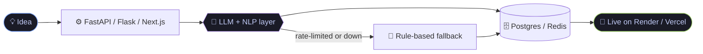

 

 

  

 

## ⚡ What I Build

<table align="center">
<tr>
<td width="33%" valign="top">

### 🧠 AI / LLM Backends
NLP pipelines, LLM orchestration, retrieval and scoring engines. Gemini, Groq and local Ollama models behind clean **FastAPI / Flask** services.

</td>
<td width="33%" valign="top">

### 🌐 Full-Stack Products
Next.js + TypeScript apps with real data layers (**Supabase, Postgres, Redis**) and live deployments, not just localhost demos.

</td>
<td width="33%" valign="top">

### 🔐 Tools with a Point of View
Privacy-first utilities, explainable scoring, resilient fallbacks. I like software that says **why**, and never fails silently.

</td>
</tr>
</table>

---

## 🚀 Flagship Projects

### 🔬 ASHLYSIS — AI Exam Intelligence Platform

> `Python` `Flask` `Gemini API` `TF-IDF` `PyMuPDF` `Render`

- NLP pipeline achieving **~95% topic-detection accuracy** across uploaded exam PDFs
- Gemini LLM generates **personalised study plans** from documents in under 5s
- Flask backend with PyMuPDF OCR for structured multi-page PDF extraction

### 📈 SentiFi — AI Market Sentiment Analyzer

> `Python` `FastAPI` `NLP` `PostgreSQL` `Render`

- **BUY/HOLD/SELL signals** across 500+ equity tickers with sub-5s response time
- Batch NLP pipeline processing **500+ articles/day** with historical signal replay
- Interactive dashboard visualising sentiment trends and confidence scores

### 🏥 Dadi Ki Dawai — AI Healthcare Assistant

> `Python` `Flask` `Groq LLM` `REST API` `JavaScript` `PWA` `Render`

- Handles **20+ symptom categories** with context-aware multi-turn conversations under 3s
- Health report generation, conversation history & session management via REST APIs
- Deployed as a **PWA**, no app-store install needed

### 🤖 Autonomous AI Creator — a self-running AI persona

> `TypeScript` `Next.js` `Redis` `LLM` `Hacker News API` `arXiv API` `Vercel`

- Discovers topics live from **Hacker News, arXiv and GitHub**, then publishes with **zero human input** after init
- An LLM "editor" picks at most one topic and must **log a reason for every rejection**
- Redis fingerprint memory means it never re-covers the same ground; a cron tick keeps it publishing on a schedule

### ⚔️ Mainland — Mahabharata Meets Action-RPG

> `Python` `Vercel Serverless` `Gemini API` `Vanilla JS` `Canvas 2D` `HTML/CSS`

- A **Pac-Man-style arcade maze crawler** fused with a modern RPG. You play **Arjun**, descending 7 floors to recover the Brahmastra, ending at the Field of Kurukshetra
- **Python serverless functions** on Vercel: a procedural **BSP dungeon generator**, plus **Gemini-powered** NPC dialogue (Draupadi, Karna, Shakuni, Gandhari, Bhima), boss taunts (Duryodhana, Kali) and floor narration
- Every AI line has a hand-written fallback, so the game keeps its story even when the API is down. Frontend is **100% vanilla JS on a 2D canvas**, no framework

---

## 💼 Internship Work

<table>
<tr>
<td valign="top">

**🤝 LinkedIn CRM** · [repo ↗](https://github.com/Ashmit-702/Linnkedin-CRM) · [repo 2 ↗](https://github.com/Ashmit-702/LinkedIn-CRM) 
Did the research and **LinkedIn API work**, plus the **CRM work** for my internship company (Cerebro). 
<code>Research</code> <code>LinkedIn API</code> <code>CRM</code>

</td>
</tr>
</table>

---

## 🧪 More From the Lab

<table>
<tr>
<td width="50%" valign="top">

**🏏 [GitWicket](https://github.com/Ashmit-702/Gitwicket)** · [live ↗](https://gitwicket-ten.vercel.app) 
Your GitHub, rated as a **cricket player card**. Commits become strike rate, PRs become wickets. Live PNG badges via `@vercel/og`, GitHub GraphQL and a Redis cache. 
<code>TypeScript</code> <code>Next.js</code> <code>GraphQL</code> <code>Redis</code>

</td>
<td width="50%" valign="top">

**🗳️ [NetaBoard](https://github.com/Ashmit-702/Netaboard)** · [live ↗](https://neta-ashen.vercel.app) 
*Politics, with receipts.* Claims → evidence → verdicts, live news clustering and ranking, built as an editorial product rather than a widget dashboard. 
<code>Next.js 14</code> <code>Supabase</code> <code>JavaScript</code>

</td>
</tr>
<tr>
<td width="50%" valign="top">

**🛒 [One](https://github.com/Ashmit-702/One)** · [live ↗](https://one-delta-amber.vercel.app) 
Ask for a product with constraints ("mobile under 20k INR") and get **exactly one pick + a one-line reason**. Retrieval, local **Ollama** extraction and generic weighted scoring, with no per-category logic. 
<code>FastAPI</code> <code>Ollama</code> <code>SQLite</code> <code>Jinja2</code>

</td>
<td width="50%" valign="top">

**📄 [DOSSIER](https://github.com/Ashmit-702/CV-Analyze)** · [live ↗](https://cv-analyze-liard.vercel.app) 
Résumé-to-job matching scored across **five independently-weighted dimensions**, where every number comes with a reason. ATS-style, explainable. 
<code>Python</code> <code>FastAPI</code> <code>NLP</code>

</td>
</tr>
<tr>
<td width="50%" valign="top">

**🔐 [SecurePass Toolkit](https://github.com/Ashmit-702/Passwrod-O)** · [live ↗](https://passwrod-o.vercel.app) 
Password generator, breach checker and encrypted vault running **entirely in the browser**. Web Crypto AES-256-GCM + PBKDF2, and HIBP k-anonymity so your password never leaves the device. 
<code>Next.js</code> <code>Web Crypto</code> <code>Tailwind</code>

</td>
<td width="50%" valign="top">

**🔗 [SnapLink](https://github.com/Ashmit-702/Urlshortener)** · [live ↗](https://snaplink-0ha1.onrender.com) 
URL shortener with a click-analytics engine (device, browser, OS, referrer). IPs are **SHA-256 hashed, never stored raw**. 
<code>Node.js</code> <code>Express</code> <code>PostgreSQL</code>

</td>
</tr>
<tr>
<td width="50%" valign="top">

**💓 [Vitals+](https://github.com/Ashmit-702/OIBSIP-f)** · [live ↗](https://oibsip-teal.vercel.app) 
A BMI calculator grown into a health-analytics platform: trend charts, **BMI forecasting**, and a hybrid AI insight engine that auto-falls back to a rule-based generator when Gemini rate-limits. 
<code>Python</code> <code>Gemini</code> <code>Flask</code>

</td>
<td width="50%" valign="top">

**🌦️ [Station](https://github.com/Ashmit-702/Station-Weather)** · [live ↗](https://station-weather.vercel.app) 
A weather app styled like a physical **weather-station instrument panel** (barograph, sun-path arc, air-quality gauge). The API key stays server-side. 
<code>Flask</code> <code>Vanilla JS</code> <code>pytest</code>

</td>
</tr>
<tr>
<td width="50%" valign="top">

**🎮 [ATTACK](https://github.com/Ashmit-702/Game-Site)** · [live ↗](https://game-site-woad.vercel.app) 
Zero-build gaming storefront with search, wishlist, spec comparison and simulated checkout, priced in INR. 
<code>HTML</code> <code>CSS</code> <code>JavaScript</code>

</td>
<td width="50%" valign="top">

**🌐 [Portfolio](https://ashmit-702.github.io/portfolio/)** · [repo](https://github.com/Ashmit-702/portfolio) 
The full showcase with write-ups, screenshots and contact. 
<code>HTML</code> <code>CSS</code> <code>GitHub Pages</code>

</td>
</tr>
</table>

---

## 🏏 My GitHub, Rated as a Cricketer

  
   
  Live-rendered by <a href="https://github.com/Ashmit-702/Gitwicket">GitWicket</a>, a tool I built. <a href="https://gitwicket-ten.vercel.app">Get your own card →</a>

---

## 🛠️ Tech Stack

 
 
 

---

## 🔄 How I Ship

---

## 📊 GitHub Stats

<b>🐍 Contribution snake (click to expand)</b>

 

  

  

---

## 🏅 Certifications & Recognition

| | Achievement | Issuer |
|---|---|---|
| 🏆 | **Konam AI Fellowship** (selected) | Konam |
| 🟡 | Honeywell AI Certificate | Honeywell |
| ☁️ | AWS Academy Graduate — Cloud Foundations | Amazon Web Services |
| 🤖 | AI-ML Virtual Internship | Google Developers × AICTE |
| 📊 | Data Science Master Internship | Altair × AICTE |
| 🐍 | Python Programming Internship | Oasis Infobyte |

---

## 🌱 Currently

- 🔭 Pushing LLM pipelines from "it works" to "it works reliably" (fallbacks, caching, evals)
- 📚 Deepening cloud + containers (AWS, Docker)
- 🤝 Open to internships, hackathon teams and interesting backend problems

**💬 Want to build something? [Say hi →](mailto:ashmitsingh702@gmail.com)**

